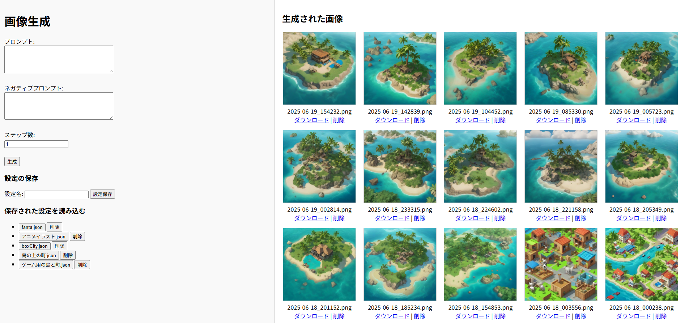
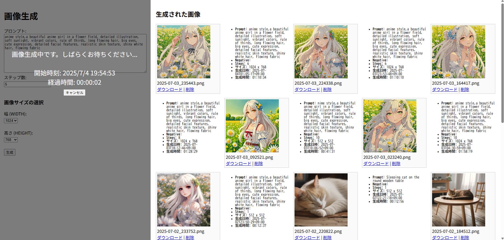

+ OnnxStream用にブラウザから操作できるUIを作りました（Flask製）

    + トップ画面  


    + 画像生成中は、ロック状態となります（負荷かけたくないので一度に１枚ずつ）  


+ OnnxStreamはビルドの仕方が随分簡単になった模様

```
git clone https://github.com/vitoplantamura/OnnxStream.git
cd OnnxStream/src
mkdir build
cd build
cmake ..
cmake --build . --config Release
```


最近のバージョンでは自動的に選択したモデルをダウンロードするらしい

```
cd ~/OnnxStream/src/build
./sd --rpi-lowmem --turbo  --prompt "An astronaut riding a horse on Mars" --steps 1 --output astronaut.png --download
```
これで、astronaut.pngが出来上がると思うのでここまで確認してください。--downloadが指定されているので、モデルもダウンロードされます（ここかなり時間がかかります）

実は他のモデルも試してみたのですが、時間がかかるわ、クオリティ低いわで使えないと判断しました。今回は、turboだけ使うことにします。ただし、turboだとネガティブプロンプトが使えません。この辺り少し残念に感じますが仕方ありません。


+ ここから本Git(OnnxStreamWebUI)の説明です。cd ~してから、本 git を cloneしてください。
以下を行う前に、上記テストでモデルのダウンロードも完了している必要がありますう。

```
chmod +x launch.sh
./launch.sh

```

+ 起動確認  
    http://RaspberryPiのURL:5000 を開き
    プロンプトに以下を注入
    ```
    anime stye, a beautiful anime girl in a flower field, detailed illustration, soft sunlight, variant colors, rules of thirds, long flowing hair, big eyes, cute expression, detailed facial features, realistic skin texture, shiny white hair, flowing fabric
    ```
    Stepは５、サイズは1024 x 768で生成してみてください

    おそらく２時間ちょいかかりますがなにやら画像が生成されることでしょう。

+ 最後に  
今回のWebUIでは、turboモデルのみ対応しています。他のモデルをつかってみたところ、使い物にならなかったので、turboだけでいいやという判断をしました。異論があれば受け入れますので、どうぞご連絡ください。

