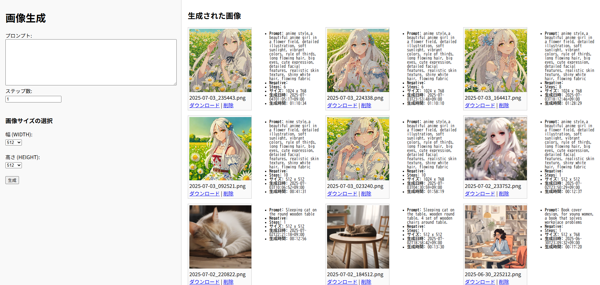

+ OnnxStream用にブラウザから操作できるUIを作りました（Flask製）

    + トップ画面  


    + 画像生成中は、ロック状態となります（負荷かけたくないので一度に１枚ずつ）  


+ 公式を見ればわかりますが、OnnxStreamをRaspberryPiに仕込む説明

```
sudo apt-get update
sudo apt-get install -y cmake python3-pip libjpeg-dev libopenblas-dev libopenmpi-dev libomp-dev
sudo -H pip3 install setuptools==58.3.0
sudo -H pip3 install Cython
sudo -H pip3 install gdown


cd ~
git clone https://github.com/google/XNNPACK.git
cd XNNPACK
git checkout 1c8ee1b68f3a3e0847ec3c53c186c5909fa3fbd3
mkdir build
cd build
cmake -DXNNPACK_BUILD_TESTS=OFF -DXNNPACK_BUILD_BENCHMARKS=OFF ..
cmake --build . --config Release

cd ~
git clone https://github.com/vitoplantamura/OnnxStream.git
cd OnnxStream
cd src
mkdir build
cd build
cmake -DMAX_SPEED=ON -DOS_LLM=OFF -DOS_CUDA=OFF -DXNNPACK_DIR=~/XNNPACK ..
cmake --build . --config Release


cd ~
git lfs install
git clone --depth=1 https://huggingface.co/vitoplantamura/stable-diffusion-xl-turbo-1.0-anyshape-onnxstream

cd ~
cd OnnxStream/src/build/
./sd --rpi-lowmem --turbo --models-path ../../../stable-diffusion-xl-turbo-1.0-anyshape-onnxstream/ --prompt "An astronaut riding a horse on Mars" --steps 1 --output astronaut.png

```
これで、astronaut.pngが出来上がると思うのでここまで確認してください。


+ ここから本Gitの説明です。cd ~してから、本 git を cloneしてください。

```
chmod +x launch.sh
./launch.sh

```
+ 以上で立ち上がります。

